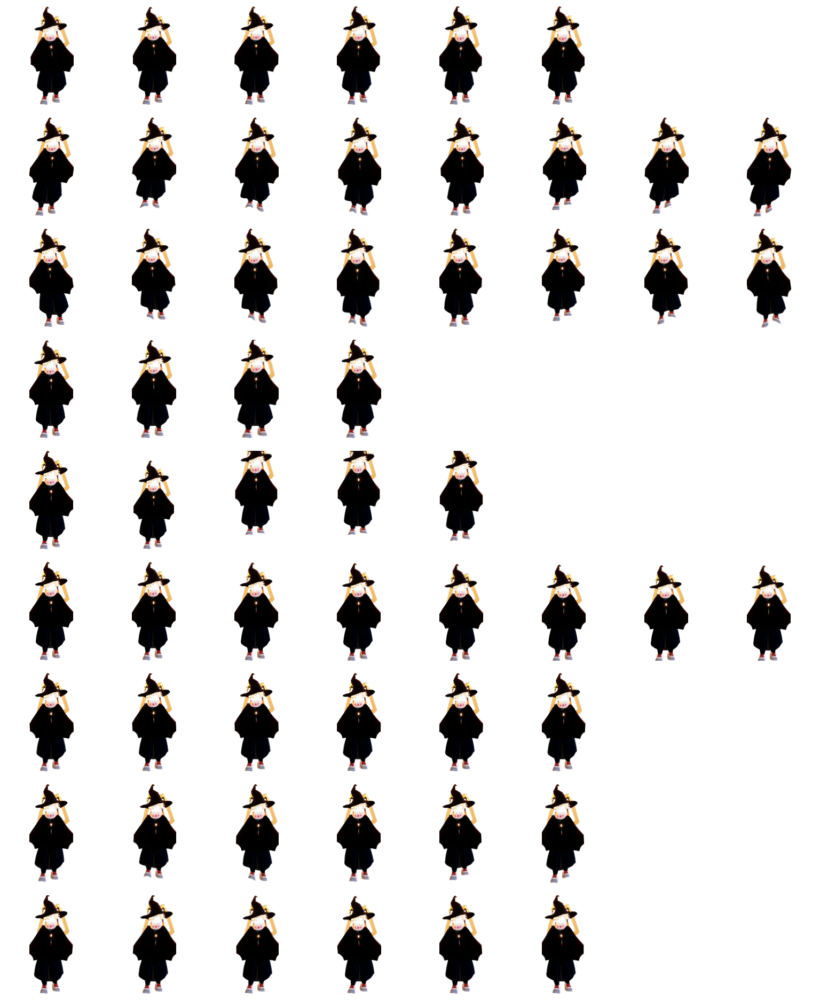

# 巫师桌宠

一只戴尖帽的巫师，住在 dsh 的 web 界面里。它跟着你的会话活动呼吸、挥手、蹦跳，
在你干活的时候安静陪你，饿了要小鱼干，摸头会涨亲密度。

这是一份生日礼物。

## 它长这样



上面是它的完整动作图集（八列九行，依次是：待机 / 向右跑 / 向左跑 / 挥手 / 跳跃 / 沮丧 / 等待 / 干活 / 审阅）。

## 装上它

在装了 dsh 的机器上执行（把 `<profile>` 换成你在用的 profile 名，默认通常是 `desktop`）：

```powershell
dsh plugin --profile <profile> add github:<你的 GitHub 用户名>/<仓库名>
```

或者在 dsh web 界面的**插件管理器**里选「从 GitHub 安装」，填入仓库地址。

这条命令会自动把本包装进 profile 的插件层（包声明了 `dsh.bundle.patch`，dsh 安装后会自行登记，
不需要手动改 `package.json`）。装完后**重启 dsh web**（宠物名册在启动时构建一次），巫师就会出现。

## 怎么玩

| 面板按钮 | 作用 |
| --- | --- |
| 喂食 | 花掉 1 条小鱼干，亲密度 +4（有 30 秒冷却） |
| 改名 | 给它换个名字 |
| 隐藏 | 把它收起来，随时能再召唤 |

它还会默认显示一行状态：**名字 · 亲密度等级 · 点数 · 小鱼干存量**。
直接摸它（点一下）也能涨亲密度，10 秒冷却。

### 小鱼干

- **每天第一次打开 dsh，送 2 条**。
- 另外每干完 30 轮对话，再奖励 1 条。
- 最多攒 20 条。

### 亲密度等级

亲密度来自三处：每完成一轮对话 +1，每喂食一次 +4，**每在线 1 小时 +2**。

| 点数 | 等级 |
| --- | --- |
| 0 | 初遇 |
| 25 | 同路人 |
| 50 | 挚友 |
| 80 | 心灵契约 |
| 200 | 心有灵犀 |
| 500 | 传说羁绊 |
| 2000 | 灵魂共鸣 |
| 10000 | 永恒之约 |
| 100000 | 星辰共渡 |

在线时长只累计 dsh **真的开着**的时间：窗口关掉之后的那一段不会补算。

## 已经装过别的桌宠怎么办

同一个 profile 里**只能有一只桌宠**（都用同一个 `pet` 服务名），但这件事这个包已经替你处理好了：
它的补丁会先禁用上游桌宠行（`dsh-web-all` 展开出来的 `web-ui-pet`），再把自己插进去，
所以**直接装就行，不需要手动改任何配置**。

- 装过 `dsh-web-all` 全家桶（自带一只鲸鱼桌宠）的机器：实测可以正常安装启动，巫师接管显示，
  原来那只不再出现，但**它的存档原样保留** —— 把这个包卸掉，原来那只就回来了。
- 没装过桌宠的干净 profile：补丁里那条针对不存在插件的禁用会被直接忽略，不会报错。

## 关于素材

角色形象取材自一份玩家自摄的游戏截图，经抠像后重制为剪纸分层动画；
仓库内**不包含**任何游戏原始资源文件。本作品为免费非商业同人作品，请勿用于售卖。

素材（`assets/wizard/`）以 CC BY-NC 4.0 授权；代码部分沿用 Apache-2.0。

运行时改造自 [@linxin666/dsh-pet](https://www.npmjs.com/package/@linxin666/dsh-pet)（Apache-2.0），
沿用其许可证与署名。改动内容：等级名与奖励参数、每日小鱼干、在线时长亲密度。

## 许可

Apache-2.0（见 [LICENSE](LICENSE)）。
